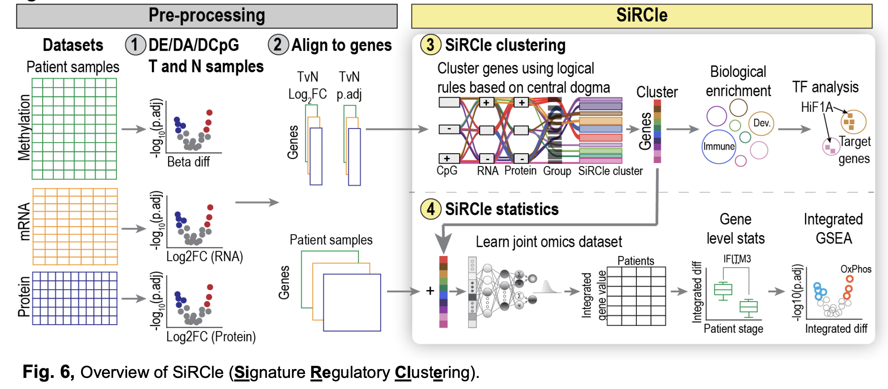
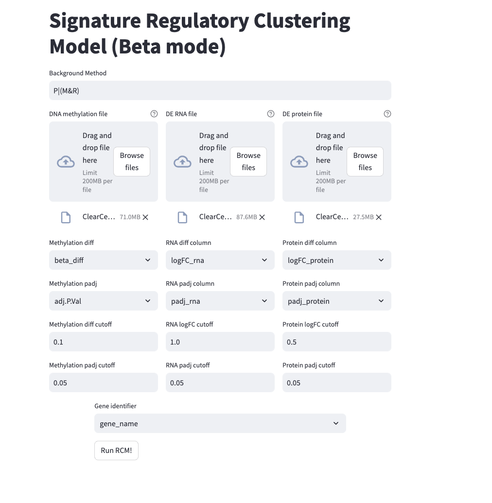
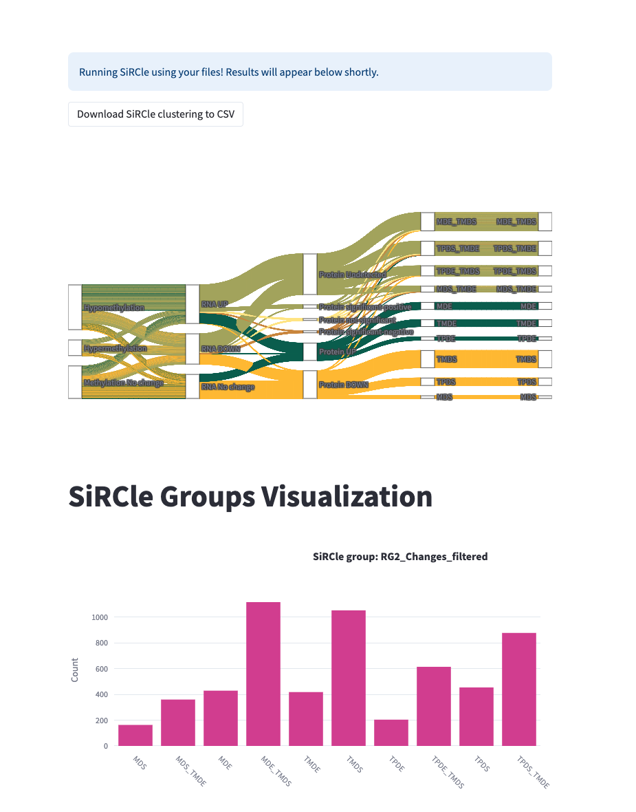

**********************************************************************************************************************
SiRCle (Signature Regulatory Clustering) model integration reveals mechanisms of phenotype regulation in renal cancer
**********************************************************************************************************************

Running
=======
If you're interested in running SiRCLe we have 3 options:

1. `website <https://arianemora-sircle-web-app-ndu996.streamlit.app/>`_
2. `Python version <https://github.com/ArianeMora/scircm>`_
3. `R version <https://github.com/ArianeMora/SiRCleR>`_

Paper
=====
Published here: `here <https://genomemedicine.biomedcentral.com/articles/10.1186/s13073-024-01415-3>`_.

Always happy to hear feedback and suggestions :)

Links to manuscript data and outputs
------------------------------------

We did our best to make everything as reproducible as possible but if you notice anything that isn't please let us know!
Same with the code we did our best to ensure it all runs, so if it doesn't please let us know and we will update it ASAP.

- `Analyses, reproducibility, and processed data <https://arianemora.github.io/SiRCle_multiomics_integration/>`_
- `Data from the manuscript <https://zenodo.org/records/14176842>`_

Information
===========
This site hosts the information associated with the paper: **SiRCle (Signature Regulatory Clustering) model integration reveals mechanisms of phenotype regulation in renal cancer**.
Here we provide the code and data used for all the analyses in the paper and link to the packages we developed as part of
producing the paper. Note the code in **manuscript_reproducibility** is from prior to our revision. While **to_publish_clean** is
 all the notebooks and HTML outputs from every figure in the paper.

We also have all data, code and everything on `Zenodo <https://zenodo.org/records/14176842>`_.

Places where this (or a package we developed for this) has been presented
-------------------------------------------------------------------------

.. list-table::
   :widths: 15 30 15
   :header-rows: 1

   * - Date
     - Conference
     - Type
   * - 28 April 2021
     - Melbourne bioinformatics seminar series
     - Presentation
   * - 25 May 2021
     - `Vizbi <https://vizbi.org/Posters/2021/vD02>`_
     - Poster
   * - 15 - 17 Sep 2021
     - `Multiomics to Mechanisms: Challenges in Data Integration <https://www.embl.org/about/info/course-and-conference-office/events/ees21-09/>`_
     - Short talk
   * - 15 Jan 2022
     - Multi-Omics ONLINE - Webinar 2: Data integration and interpretation to unveil novel insights
     - Talk

Overview
========

Website
=======

`website <https://arianemora-sircle-web-app-ndu996.streamlit.app/>`_

Authors
=======

Ariane Mora^1, Christina Schmidt^2,3, Brad Balderson1, Christian Frezza3#, Mikael Bodén1#

1) School of Chemistry and Molecular Biosciences, University of Queensland, Molecular Biosciences Building 76, St Lucia QLD 4072, Australia.
2) Medical Research Council Cancer Unit, University of Cambridge, Hutchison/MRC Research Centre, Box 197, Cambridge Biomedical Campus, Cambridge CB2 0X2, United Kingdom
3) CECAD Research Center, University Hospital Cologne, Joseph-Stelzmann-Str. 26, 50931 Cologne, Germany

^Joint first authors equally contributed; the order is interchangeable and up to the authors discretion
#Joint last authors

Note Christina and Ariane are equal joint first authors and the authors may swap the order of their names as they so choose :)

