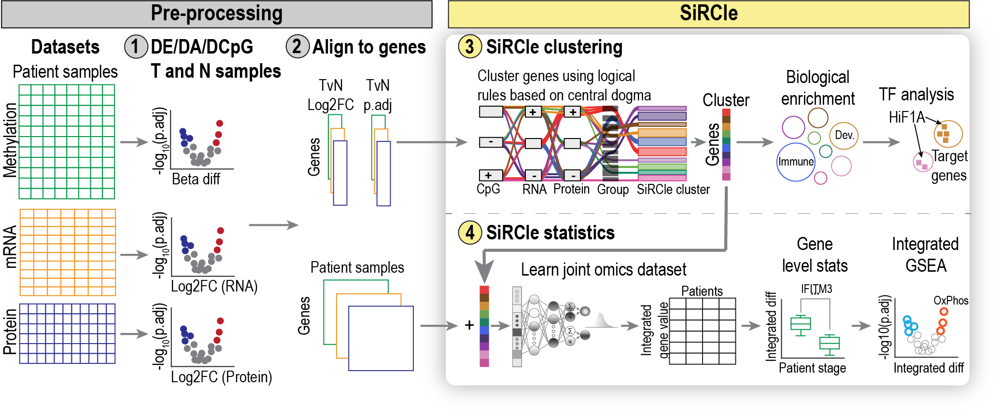

.. _about:

SUMMARY
=======

Preprint: `bioRxiv <X>`_

**********************************************************************************************************************
SiRCle (Signature Regulatory Clustering) model integration reveals mechanisms of phenotype regulation in renal cancer
**********************************************************************************************************************

Ariane Mora^1, Christina Schmidt^2,3, Brad Balderson1, Christian Frezza3#, Mikael Bodén1#

1) School of Chemistry and Molecular Biosciences, University of Queensland, Molecular Biosciences Building 76, St Lucia QLD 4072, Australia.
2) Medical Research Council Cancer Unit, University of Cambridge, Hutchison/MRC Research Centre, Box 197, Cambridge Biomedical Campus, Cambridge CB2 0X2, United Kingdom
3) CECAD Research Center, University Hospital Cologne, Joseph-Stelzmann-Str. 26, 50931 Cologne, Germany

^Joint first authors
#Joint last authors

Note Christina and Ariane are equal joint first authors and the authors may swap the order of their names as they so choose :)

Abstract
========
ToDo.

sci-RegulatoryClusteringModel
-----------------------------

[Link to docs](https://arianemora.github.io/scircm/)

## Regulatory clustering model

The general table of how we define regulatory clusters.

.. code-block:: python

    """
        | Methylation      | RNAseq    | Proteomics | Regulation driver_1          | Regulation driver_2     | Regulation_Grouping1 | Regulation_Grouping2 | Regulation_Grouping3 |
        |------------------|-----------|------------|------------------------------|-------------------------|----------------------|----------------------|----------------------|
        | Hypermethylation | DOWN      | DOWN       | Methylation increase (MDS)   | None                    | MDS                  | MDS                  | MDS                  |
        | Hypermethylation | UP        | DOWN       | mRNA increase (TPDE)         | Protein decrease (TMDS) | TPDE+TMDS            | TPDE+TMDS            | TMDS                 |
        | Hypermethylation | UP        | UP         | mRNA increase (TPDE)         | None                    | TPDE                 | TPDE                 | TPDE                 |
        | Hypermethylation | DOWN      | UP         | Methylation increase (MDS)   | Protein increase (TMDE) | MDS+TMDE             | TMDE                 | TMDE                 |
        | Hypermethylation | No Change | UP         | mRNA increase (TPDE)         | Protein increase (TMDE) | TPDE+TMDE            | TMDE                 | TMDE                 |
        | Hypermethylation | No Change | DOWN       | mRNA increase (TPDE)         | Protein decrease (TMDS) | TPDE+TMDS            | TMDS                 | TMDS                 |
        | Hypermethylation | UP        | No Change  | mRNA increase (TPDE)         | Protein decrease (TMDS) | TPDE+TMDS            | TPDE+TMDS            | TMDS                 |
        | Hypermethylation | DOWN      | No Change  | Methylation increase (MDS)   | Protein increase (TMDE) | MDS+TMDE             | MDS+TMDE             | TMDE                 |
        | Hypermethylation | No Change | No Change  | Methylation increase (ncRNA) | None                    | MDS-ncRNA            | MDS_ncRNA            | MDS_ncRNA            |
        | Hypomethylation  | DOWN      | DOWN       | mRNA decrease (TPDS)         | None                    | TPDS                 | TPDS                 | TPDS                 |
        | Hypomethylation  | UP        | DOWN       | Methylation decrease (MDE)   | Protein decrease (TMDS) | MDE+TMDS             | TMDS                 | TMDS                 |
        | Hypomethylation  | UP        | UP         | Methylation decrease (MDE)   | None                    | MDE                  | MDE                  | MDE                  |
        | Hypomethylation  | DOWN      | UP         | mRNA decrease (TPDS)         | Protein increase (TMDE) | TPDS+TMDE            | TPDS+TMDE            | TMDE                 |
        | Hypomethylation  | No Change | UP         | mRNA decrease (TPDS)         | Protein increase (TMDE) | TPDS+TMDE            | TMDE                 | TMDE                 |
        | Hypomethylation  | No Change | DOWN       | mRNA decrease (TPDS)         | Protein decrease (TMDS) | TPDS+TMDS            | TMDS                 | TMDS                 |
        | Hypomethylation  | UP        | No Change  | Methylation decrease (MDE)   | Protein decrease (TMDS) | MDE+TMDS             | MDE+TMDS             | TMDS                 |
        | Hypomethylation  | DOWN      | No Change  | mRNA decrease (TPDS)         | Protein increase (TMDE) | TPDS+TMDE            | TPDS+TMDE            | TMDE                 |
        | Hypomethylation  | No Change | No Change  | Methylation decrease (ncRNA) | None                    | MDE+ncRNA            | MDE_ncRNA            | MDE_ncRNA            |
        | No Change        | DOWN      | UP         | mRNA decrease (TPDS)         | Protein increase (TMDE) | TPDS+TMDE            | TPDS+TMDE            | TMDE                 |
        | No Change        | UP        | DOWN       | mRNA increase (TPDE)         | Protein decrease (TMDS) | TPDE+TMDS            | TPDE+TMDS            | TMDS                 |
        | No Change        | DOWN      | DOWN       | mRNA decrease (TPDS)         | None                    | TPDS                 | TPDS                 | TPDS                 |
        | No Change        | UP        | UP         | mRNA increase (TPDE)         | None                    | TPDE                 | TPDE                 | TPDE                 |
        | No Change        | No Change | UP         | Protein increase (TMDE)      | None                    | TMDE                 | TMDE                 | TMDE                 |
        | No Change        | No Change | DOWN       | Protein decrease (TMDS)      | None                    | TMDS                 | TMDS                 | TMDS                 |
        | No Change        | UP        | No Change  | mRNA increase (TPDE)         | Protein decrease (TMDS) | TPDE+TMDS            | TPDE+TMDS            | TMDS                 |
        | No Change        | DOWN      | No Change  | mRNA decrease (TPDS)         | Protein increase (TMDE) | TPDS+TMDE            | TPDS+TMDE            | TMDE                 |
        | No Change        | No Change | No Change  | NoChange                     | NoChange                | NoChange             | NoChange             | NoChange             |
    """

Please post questions and issues related to sci-rcm on the `Issues <https://github.com/ArianeMora/scircm/issues>`_  section of the GitHub repository.

