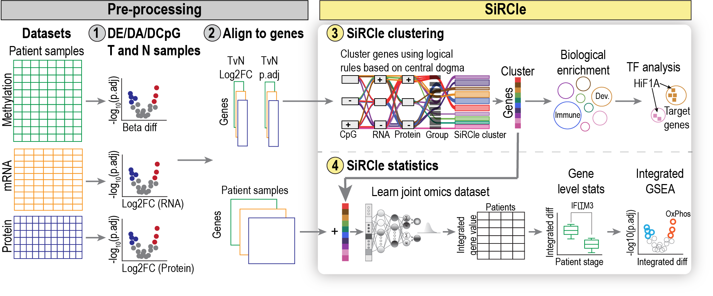

**********************************************************************************************************************
SiRCle (Signature Regulatory Clustering) model integration reveals mechanisms of phenotype regulation in renal cancer
**********************************************************************************************************************

Information
===========
This site hosts the information associated with the paper: **SiRCle (Signature Regulatory Clustering) model integration reveals mechanisms of phenotype regulation in renal cancer**.
Here we provide the code and data used for all the analyses in the paper and link to the packages we developed as part of
producing the paper.

Links to analyses and data
--------------------------

- Preprint: `bioRxiv <X>`_
- HTML outputs are available on the left panel
- Code and processed data is available at: `here <https://github.com/ArianeMora/mouseCNS_vae>`_
- Data can be downloaded here: ...

Places where this (or a package we developed for this) has been presented
-------------------------------------------------------------------------

.. list-table::
   :widths: 15 30 15
   :header-rows: 1

   * - Date
     - Conference
     - Type
   * - 28 April 2021
     - Melbourne bioinformatics seminar series
     - Presentation
   * - 25 May 2021
     - `Vizbi <https://vizbi.org/Posters/2021/vD02>`_
     - Poster
   * - 15 - 17 Sep 2021
     - `Multiomics to Mechanisms: Challenges in Data Integration <https://www.embl.org/about/info/course-and-conference-office/events/ees21-09/>`_
     - Short talk
   * - 15 Jan 2022
     - Multi-Omics ONLINE - Webinar 2: Data integration and interpretation to unveil novel insights
     - Talk
     
Authors
=======

Ariane Mora^1, Christina Schmidt^2,3, Brad Balderson1, Christian Frezza3#, Mikael Bodén1#

1) School of Chemistry and Molecular Biosciences, University of Queensland, Molecular Biosciences Building 76, St Lucia QLD 4072, Australia.
2) Medical Research Council Cancer Unit, University of Cambridge, Hutchison/MRC Research Centre, Box 197, Cambridge Biomedical Campus, Cambridge CB2 0X2, United Kingdom
3) CECAD Research Center, University Hospital Cologne, Joseph-Stelzmann-Str. 26, 50931 Cologne, Germany

^Joint first authors equally contributed; the order is interchangeable and up to the authors discretion
#Joint last authors

Note Christina and Ariane are equal joint first authors and the authors may swap the order of their names as they so choose :)

Abstract
========
Clear cell renal cell carcinoma (ccRCC) tumours develop and progress via complex remodelling of the kidney epigenome, transcriptome, proteome, and metabolome. Given the subsequent tumour and inter-patient heterogeneity, drug-based treatments report limited success, calling for multi-omics studies to extract regulatory relationships, and ultimately, to develop targeted therapies. However, current methods are unable to extract nonlinear multi-omics perturbations.

Here, we present SiRCle (Signature Regulatory Clustering), a novel method to integrate DNA methylation, RNA-seq and proteomics data. Applying SiRCle to a case study of ccRCC, we disentangle the layer (DNA methylation, transcription and/or translation) where dysregulation first occurs and find the primary biological processes altered. Next, we detect regulatory differences between patient subsets by using a variational autoencoder to integrate omics’ data followed by statistical comparisons on the integrated space. In ccRCC patients, SiRCle allows to identify metabolic enzymes and cell-type-specific markers associated with survival along with the likely molecular driver behind the gene’s perturbations.

Getting in touch
=================

Please contact CS (christina.schmidt@uni-koeln.de), and AM (uqamora@uq.edu.au)

Citing the preprint
===================
Link to preprint

.. toctree::
   :caption: Package info
   :maxdepth: 1

   about
   installing/index

.. toctree::
   :caption: Reproducibility
   :maxdepth: 1

   examples/N01_RNAProcessing
   examples/N02_ClinicalProcessing
   examples/N03_protein_imputation
   examples/N04_ProteinProcessing
   examples/N05_MethProcessing
   examples/N06_PhosphoProteinProcessing
   examples/N07_RNAProcessing
   examples/N08_DatasetGeneration
   examples/N09_TvN_DE_DA_CpG
   examples/N10_MethylationFilter
   examples/N11_SiRCle_RCM
   examples/N12_SiRCle_ORA_GSEA
   examples/N13_SiRCle_ORA_vis
   examples/N14_TF
   examples/N15_VAE_Integration
   examples/N16_Integration_GSEA
   examples/N17_SingleCell_setup
   examples/N17_singlecell_StageIV-StageI
   examples/N18_singlecell_PBRM1-BAP1
   examples/N20_Metabolomics_TvN
   examples/N21_Metabolomics_RCM
   examples/N22_Metabolomics_VAE
   examples/Benchmarking

.. toctree::
   :caption: About
   :maxdepth: 1

   faq
   changelog
   references

